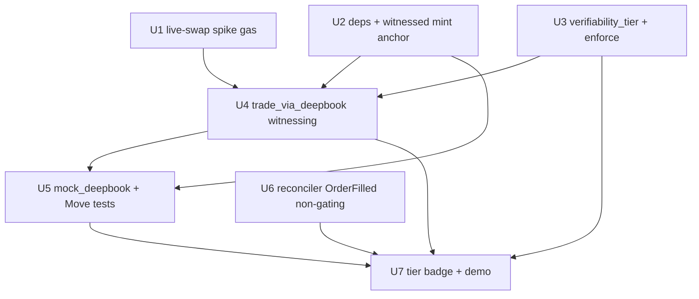

# feat: Trustless DeepBook Vertical via Witnessed Execution

## Overview

Add a new **trustless tier** to Oathkeeper for DeepBook oaths: instead of trusting the operator's self-reported `record_trade` numbers, the contract **witnesses** execution — trades route *through* the oath, so the contract records DeepBook's own returned executed amounts, and derives equity/drawdown from on-chain `balance()` reads. The operator's claim is never consulted; a lying operator simply gets a normal Broken settlement on real data.

This is **additive**: the shipped v2 5-role 10/20/70 economics, `settle_epoch`, conservation, claims, the off-chain reconciler, the read-only verifier (`pnpm verify`), and the Next.js app all stay. The witnessed path is a new tier beside the existing self-reported path, distinguished by a `verifiability_tier` field.

## Problem Frame

A 7-lens council's kill-shot: outcome attestation is self-reported (`record_trade` trusts caller-supplied equity/PnL/fills), so settlement enforces the math trustlessly but trusts the inputs — "verifiable" is true only where opacity is moot. A verification council then proved (against DeepBook v3 source) that the naive fixes are **infeasible in Move**: fills are events Move can't read, and a proof-gated settle breaks liveness. The only Move-enforceable trustless construction is **witnessing / capture-at-execution** (see origin: docs/brainstorms/2026-06-03-trustless-deepbook-vertical-requirements.md).

## Requirements Trace

- R1. Witnessed-execution path records DeepBook's returned executed amounts; entry has **no caller-supplied** equity/notional/count params.
- R2. Starting equity snapshotted from `balance<T>(&bm)` on-chain at bind (replace self-reported anchor for witnessed oaths).
- R3. Drawdown low-water-mark + final equity derived from `balance()`/equity-delta reads.
- R4. PnL derived from BalanceManager equity-delta, not fill-sum.
- R5. `verifiability_tier` on the Oath (WITNESSED vs SELF_REPORTED), enforced in-contract + UI badge.
- R6. TRUSTLESS headline narrowed to drawdown-survival; `min_trades` reframed as "fills routed through the oath path"; wash-trading + volume-epoch mismatch disclosed.
- R7. `settle_epoch` stays permissionless + always-terminating; never gates on a submitted off-chain proof.
- R8. Off-chain reconciler upgraded to parse `OrderFilled` events as a non-gating DISPUTABLE detection layer.
- R10. Split-screen demo: claimed self-report vs witnessed truth → Broken on unforgeable inputs.
- (R9 optional bonded-optimistic dispute is explicitly out of v1 scope below.)

## Scope Boundaries

- **No** settle-time fill-history read and **no** "contract re-checks a keeper proof" form — both verified unbuildable in Move / liveness-breaking.
- **No** trusted verifier/oracle role.
- **Do not** claim min_trades/min_volume/min_pnl are economically trustless (wash-gameable) — drawdown-survival is the only trustless headline.
- Hyperliquid + uptime/behavior stay SELF_REPORTED/DISPUTABLE — not faked.
- Don't reopen the locked 5-role 10/20/70 economics.
- R9 (bonded-optimistic dispute slashing) is deferred to a fast-follow, not v1.

## Context & Research

### Relevant Code and Patterns
- `contracts/sources/oath.move` — `Oath<phantom T>` struct, Hot-Potato mint (`start_epoch` → `bind_exec_wallet`), `record_equity_update` (package-internal mutator that sets `current_equity_usdc`/`min_equity_usdc`/`trade_count`/`cumulative_volume`), `settle_epoch` (reads those fields), `status_*`, accessors. **Key insight: if the witnessed path updates the *same* Oath fields `settle_epoch` already reads, settlement needs minimal change.**
- `contracts/sources/attestation.move` — `record_trade` (the self-reported path, gated to `exec_addr`); stays for SELF_REPORTED oaths.
- `contracts/tests/v2_tests.move`, `attestation_tests.move`, `test_utils.move` — existing mint/settle test harness + `USDC` test coin; mirror for the new tests.
- `agent/src/recon/{reconcile.ts,venue.ts,cli.ts}` — deterministic reconciler; `DeepBookVenueSource` is currently digest-existence (`existenceOnly=true`), to upgrade to fill-level.
- `frontend/src/app/(app)/mint/page.tsx`, `oaths/[oathId]/LiveOathView.tsx`, `lib/{chain.ts,ptb.ts,mock.ts}` — tier badge + demo surface; `mapOath` already reads fields defensively.
- `.context/deepbook-spike/` — working DeepBook-dependency scaffold (reuse for U1).

### External References (verified this session, against v3 source)
- `deepbook::balance_manager::balance<T>(&BalanceManager): u64` — cross-package, immutable ref only (equity anchor). **Compiles** on sui 1.60 / edition 2024.beta.
- `deepbook::pool::swap_exact_base_for_quote<B,Q>(...) : (Coin<B>, Coin<Q>, Coin<DEEP>)` and `_with_manager(... &mut BalanceManager, &TradeCap, &DepositCap, &WithdrawCap ...)` — returns executed coins in-call (the witnessing primitive).
- `deepbook::pool::account<B,Q>(&Pool,&BalanceManager): Account` → `total_volume(): u128` (DeepBook-governance-epoch-scoped; coarse).
- DeepBook v3 Move dep: `deepbook = { git = "https://github.com/MystenLabs/deepbookv3.git", subdir = "packages/deepbook", rev = "main" }` (dep key must equal package name `deepbook`).

## Key Technical Decisions

- **Witnessing over settle-time read** — Move can't read events; capturing DeepBook's returned `(Coin,Coin,Coin)` at execution is the only unforgeable construction.
- **Reuse the existing Oath fields + `settle_epoch`** — the witnessed path writes `current_equity_usdc`/`min_equity_usdc`/`trade_count`/`cumulative_volume` via a new package-internal mutator, so `settle_epoch`'s dimensional math is reused unchanged. Add only a settle-time `balance()` read for the final drawdown floor on WITNESSED oaths.
- **Additive witnessed mint entry, not a modified `bind_exec_wallet`** — keep the shipped self-reported mint path untouched (lowest blast radius). The witnessed mint snapshots starting equity from `balance()`. *(Design fork; final shape — new entry vs optional `BalanceManager` arg — deferred to implementation.)*
- **PnL from equity-delta, not fill-sum** — fill-sum is selectively bypassable (route winners through the oath, losers outside).
- **Split the swap call from the state mutation** — `trade_via_deepbook` performs the DeepBook swap, then calls a package-internal `record_witnessed_fill(oath, executed_amounts, post_balance)`. This makes the unforgeable state-mutation logic unit-testable with mock values while the live swap is covered by the spike + e2e.
- **Drawdown-survival is the only trustless claim** — disclosed; min_trades reframed as "fills routed through the oath path"; volume labeled coarse.

## Open Questions

### Resolved During Planning
- Witnessing inversion accepted; additive, not a pivot.
- DeepBook compiles + the needed getters/return-types are real (day-1 compile spike GREEN).
- Settlement reuse: witnessed path writes the same fields `settle_epoch` reads → no economics change.

### Deferred to Implementation
- Live testnet swap wiring (real Pool + funded BalanceManager + DEEP fee tokens) — gas-gated; resolved by U1 before committing U4 deeply.
- Single-coin denomination so equity needs no price oracle (assume single-asset oaths for v1 witnessed tier).
- Exact `bind` shape (new witnessed entry vs optional `BalanceManager` arg) and TradeCap/DepositCap/WithdrawCap binding mechanics.
- Exact `mock_deepbook` surface (must mirror real v3; no fictional settle-time history read).
- `OrderFilled` event field schema for the reconciler upgrade (U6).

## High-Level Technical Design

> *Directional guidance for review, not implementation specification. The implementing agent should treat it as context, not code to reproduce.*

```
SELF_REPORTED tier (unchanged):
  mint → record_trade(exec types numbers) → settle_epoch(reads self-reported fields)

WITNESSED tier (new, additive):
  mint_witnessed(reads balance() → starting_equity anchor; tier=WITNESSED)
        │
  trade_via_deepbook(Pool, BalanceManager, caps, order)         [exec_addr only]
        │   swap → DeepBook returns (base,quote,DEEP) executed
        │   post_balance = balance<T>(&bm)
        └─► record_witnessed_fill(oath, executed, post_balance):
               trade_count += 1 (routed); volume += executed; 
               current_equity = post_balance; min_equity = min(...);  (no caller input)
        │
  settle_epoch(oath, [BalanceManager for WITNESSED])            [permissionless, always terminates]
               final balance() read → drawdown floor; reuse existing Kept/Broken math
```

## Implementation Units



- [ ] **Unit 1: Live DeepBook swap spike (go/no-go, GAS-GATED)**

**Goal:** Prove the live testnet wiring works: execute one real swap through a BalanceManager+TradeCap and read `balance()` live. De-risks the only remaining unknown.
**Requirements:** R1 (validation), R3.
**Dependencies:** None (extends `.context/deepbook-spike/`). Needs gas + DEEP tokens + a testnet pool.
**Files:**
- Modify: `.context/deepbook-spike/sources/spike.move` (add a `with_manager` swap call + balance read)
- Create: `agent/src/recon/deepbook-spike.ts` (TS harness: create/fund BalanceManager, acquire DEEP, run one swap, read balance)
**Approach:** Use a liquid testnet pool (e.g. a SUI/USDC DeepBook pool); mint a BalanceManager + TradeCap; fund with DEEP for fees; `swap_exact_*_with_manager`; assert non-zero returned executed amounts + a post-swap `balance()` read. Capture the pool id + BalanceManager id for reuse in e2e.
**Execution note:** This is a probe — its output is a GO/NO-GO. If wiring is a swamp by EOD, fall back to the DISPUTABLE-reconciler-only branch (U6 + U3 badge) and stop here.
**Patterns to follow:** `agent/src/e2e.ts` (testnet run harness, role-wallet funding, `run()`/`waitForTransaction`).
**Test scenarios:** Test expectation: none — de-risking spike; success = it executes on testnet and returns non-zero executed amounts + a live balance read.
**Verification:** One testnet tx shows a DeepBook swap by the bound wallet with returned executed coins; `balance()` read returns the expected post-swap holdings.

- [x] **Unit 2: witnessed-mint tier + equity anchor (GAS-FREE; DONE — commit 87bf1d7)** *(DeepBook dep deferred to U4/U1; core mint-tier logic landed via the ScopeReservation tier thread + mark_reservation_witnessed)*

**Goal:** Add the DeepBook dep and a witnessed mint path that snapshots starting equity from `balance()` instead of a self-reported arg.
**Requirements:** R2, R5 (tier set at mint).
**Dependencies:** None for build (compile); U1 informs the live shape.
**Files:**
- Modify: `contracts/Move.toml` (add `deepbook` git dep — key must equal `deepbook`)
- Modify: `contracts/sources/oath.move` (witnessed mint entry or optional `&BalanceManager`; set `verifiability_tier`; anchor `starting_equity_usdc` from `balance()`)
- Test: `contracts/tests/witnessed_tests.move`
**Approach:** Prefer a parallel witnessed mint entry to leave the shipped `start_epoch`/`bind_exec_wallet` untouched. Stamp `verifiability_tier = WITNESSED`. Read `balance<T>(&bm)` for the starting-equity anchor. Keep the Hot-Potato `ScopeReservation` pattern.
**Patterns to follow:** `oath.move` `start_epoch`/`bind_exec_wallet` Hot-Potato flow; `test_utils.move` mint helpers.
**Test scenarios:**
- Happy path: witnessed mint sets `verifiability_tier == WITNESSED` and `starting_equity` equal to the (mocked) `balance()` read, not a caller arg.
- Edge case: self-reported mint path still works unchanged and is tagged `SELF_REPORTED`.
- Error path: minting witnessed with venue != DeepBook aborts.
**Verification:** `sui move build` clean with the DeepBook dep; a witnessed oath object carries `WITNESSED` + a chain-derived starting equity.

- [x] **Unit 3: `verifiability_tier` field + in-contract enforcement (GAS-FREE; DONE — commit 87bf1d7)** *(field + accessors + tier getters; record_trade rejects WITNESSED via ETierMismatch)*

**Goal:** Add the tier field and enforce path separation: WITNESSED oaths can't use `record_trade`; SELF_REPORTED can't use the witnessed path.
**Requirements:** R5, R6.
**Dependencies:** U2 (field introduced there or here — keep in one unit if cleaner).
**Files:**
- Modify: `contracts/sources/oath.move` (field + accessor + constants), `contracts/sources/attestation.move` (`record_trade` asserts tier == SELF_REPORTED)
- Test: `contracts/tests/witnessed_tests.move`
**Approach:** Add `verifiability_tier: u8` (constructor-initialized; defensive default for old objects via accessor). Assert in `record_trade` and `trade_via_deepbook` that the caller is on the correct tier.
**Patterns to follow:** the `disputed`/`dispute_count` additive-field precedent already in `oath.move`.
**Test scenarios:**
- Error path: `record_trade` on a WITNESSED oath aborts; `trade_via_deepbook` on a SELF_REPORTED oath aborts.
- Happy path: accessor returns the correct tier; old-object default is safe.
**Verification:** Tier mismatch aborts with a clear error; existing self-reported tests still pass.

- [ ] **Unit 4: `trade_via_deepbook` witnessed-execution entry (BLOCKED on toolchain; reference written)** *(Module fully written — preserved at `.context/deepbook-spike/witnessed.move.reference`: `mint_witnessed` reads `balance()` for the anchor; `trade_via_deepbook` swaps + reads post-balance + calls `oath::record_equity_update`; no caller-supplied numbers.*
  ***Integration finding (attempted in-package compile):** DeepBook v3's modules are addressed at `0x0` (a placeholder for the newer Published.toml auto-resolution; testnet original-id `0xfb28c4cb…`, chain-id 4c78adac). Under Sui CLI 1.60, `deepbook::registry` collides with `oathkeeper::registry` at 0x0, and a manual `[addresses]` pin conflicts with the dep's own `0x0` ("Conflicting assignments for address 'deepbook'"). DeepBook's package toolchain is 1.69.2.*
  ***Two resolution paths (do in the U1/gas phase):** (a) upgrade the Sui CLI to ≥1.69 so Published.toml env-based address resolution applies; or (b) rename `oathkeeper::registry` → e.g. `oath_registry` to remove the short-name collision (lets it compile at 0x0; deploy still needs the real deepbook address). Deploy-time address resolution is required for U1 regardless, so bundle this there. Reverted from the main package to keep the build fast + 59 tests green.)*

**Goal:** The witnessing primitive — swap through DeepBook, record returned executed amounts + post-swap balance into the Oath; no caller-supplied numbers.
**Requirements:** R1, R3, R4.
**Dependencies:** U1 (live shape), U2 (anchor + dep), U3 (tier).
**Files:**
- Create: `contracts/sources/witnessed.move` (or extend `attestation.move`) — `trade_via_deepbook<Base,Quote>` entry
- Modify: `contracts/sources/oath.move` — package-internal `record_witnessed_fill(oath, executed_base, executed_quote, post_balance)` + a settle-time `balance()` read path for WITNESSED
- Test: `contracts/tests/witnessed_tests.move`
**Approach:** Entry takes `&mut Oath`, `&mut Pool<B,Q>`, `&mut BalanceManager`, the oath-held caps, order params, `&Clock`, `ctx`; gated to `exec_addr`. Performs the DeepBook swap, reads the returned executed coins + `balance()` post-swap, calls `record_witnessed_fill` which updates `trade_count` (routed), `cumulative_volume`, `current_equity` (= post_balance), and the `min_equity` low-water-mark. **No equity/notional/count params on the entry.** `settle_epoch` for WITNESSED takes the BalanceManager and does a final `balance()` read for the drawdown floor; reuses the existing Kept/Broken dimensional math.
**Execution note:** Implement `record_witnessed_fill` test-first against mock executed amounts (its unforgeability is the core property).
**Technical design:** see High-Level Technical Design above (directional).
**Patterns to follow:** `oath.move::record_equity_update` (the mutator it parallels); `settle_epoch` for the dimensional branch.
**Test scenarios:**
- Happy path: `record_witnessed_fill` with mock executed `(base,quote)` + post_balance updates trade_count/volume/current_equity correctly; min_equity tracks the low-water-mark across a dip-then-recover sequence.
- Unforgeability (Integration): assert `trade_via_deepbook`'s signature exposes no caller equity/notional/count params (a lying operator has no field to lie in).
- Error path: non-exec caller aborts; calling on a SELF_REPORTED oath aborts.
- Edge case: zero-fill (dead operator) leaves trade_count at 0 → Broken at settle.
**Verification:** A witnessed oath's dimensional fields are populated only from swap returns + balance reads; `sui move test` green; one live testnet trade (post-U1) records real executed amounts.

- [x] **Unit 5: Move test suite (GAS-FREE; DONE — commit 87bf1d7)** *(ADAPTED: no `mock_deepbook` module — Move can't inject a mock into the real `trade_via_deepbook`, so correctness is proven by driving `record_equity_update` (the exact mutator the witnessed entry calls) with mock CHAIN values. 6 tests: mint+anchor, tier default, record_trade rejection, Kept, drawdown low-water-mark Broken, dead-operator Broken. 53→59 green.)*

**Goal:** The headless proof that the witnessed path is unforgeable and resolves correctly.
**Requirements:** R1, R2, R3, R4 (verification).
**Dependencies:** U2, U4.
**Files:**
- Create: `contracts/tests/mock_deepbook.move` (#[test_only]; mirrors real v3 — swap returns executed `(base,quote,DEEP)`; **no fictional settle-time history read**)
- Modify/Create: `contracts/tests/witnessed_tests.move`
**Approach:** Drive the settlement matrix entirely from mock swap output. The mock's surface must match real v3 so tests can't go false-green on a capability the contract won't have in production.
**Patterns to follow:** `v2_tests.move` mint→settle harness; `test_utils.move`.
**Test scenarios:**
- Unforgeability: entry records the mock's RETURNED amounts; no caller equity/count params (assert by signature).
- Dead-operator: zero fills → `trade_count < min_trades` → Broken; no entry can inject a fake count.
- Drawdown low-water-mark: dip-then-recover fill sequence → Broken on drawdown (equity from balance/equity-delta, not input).
- Under-reporting asymmetry: fills not routed through the oath can't mutate the Oath; under-reporting only ever yields Broken.
- Anchor: starting equity from a `balance()` read at bind, not a caller arg.
- Settlement matrix: one Kept + one Broken-per-reason sequence, conservation still holds (reuse existing conservation assertions).
**Verification:** `sui move test` green with the full witnessed matrix; total test count rises from 53.

- [x] **Unit 6: Reconciler — parse `OrderFilled` events (GAS-FREE; DONE — commit c2b3899)** *(pure fillsFromOrderFilled + live DeepBookOrderFilledVenueSource, existenceOnly=false; 4 vitest cases, agent 10→14 green)*

**Goal:** Upgrade the off-chain reconciler from digest-existence to fill-level via `OrderFilled` events, as a NON-gating DISPUTABLE detection layer for maker/limit + Hyperliquid.
**Requirements:** R8.
**Dependencies:** None (parallel to contracts).
**Files:**
- Modify: `agent/src/recon/venue.ts` (`DeepBookVenueSource` → parse `OrderFilled`; `existenceOnly=false`), `reconcile.ts` if needed
- Test: `agent/src/recon/reconcile.test.ts` (extend)
**Approach:** Query DeepBook `OrderFilled` events for the bound wallet; map to `VenueFill` with asset/qty/price; keep the reconciler strictly non-gating (detection only). Drop any framing that the contract re-checks a keeper proof.
**Patterns to follow:** existing `DeepBookVenueSource`, `reconcile()` purity, the vitest fixtures.
**Test scenarios:**
- Happy path: fixture `OrderFilled` events parse into `VenueFill`s; a matching attestation → clean.
- Edge case: fabricated fill (no matching event) → flagged fabricated; verdict discrepancies.
- Edge case: existenceOnly=false enables the mismatch (asset/qty) check.
**Verification:** `pnpm test` green; `pnpm reconcile` against a witnessed oath reports fill-level findings labeled DISPUTABLE/detection.

- [x] **Unit 7: `verifiability_tier` badge (GAS-FREE; DONE — commit 714d25e)** *(defensive tier read + WITNESSED/SELF-REPORTED badge in the Verification panel; build clean. Split-screen demo deferred — needs witnessed data live = gas.)*

**Goal:** Surface the tier honestly and ship the judge-runnable demo beat.
**Requirements:** R5, R6, R10.
**Dependencies:** U3 (tier on Oath), U4 (witnessed data), U6 (reconciler output).
**Files:**
- Modify: `frontend/src/lib/{chain.ts,mock.ts}` (read `verifiability_tier` defensively), `frontend/src/app/(app)/mint/page.tsx` (set tier for DeepBook), `oaths/[oathId]/LiveOathView.tsx` + a new `components/TierBadge.tsx`, Browse cards
- Create: `frontend` demo view or `agent/src/recon/demo-witnessed.ts` — split-screen: operator's claimed self-report curve vs witnessed truth → Broken
**Approach:** WITNESSED vs SELF_REPORTED badge with an honest tooltip (drawdown-survival = trustless; rest = witnessed-not-wash-proof). The demo shows the operator claiming a kept epoch while witnessed data settles Broken.
**Patterns to follow:** existing `StatusBadge`/`RoleBadge`, the Verification panel, `mapOath` defensive reads.
**Test scenarios:** Test expectation: none for styling; the demo harness asserts the witnessed oath settles Broken when the operator's claim diverges (covered by U5 on-chain; the harness is presentation).
**Verification:** `bun run build` clean; badge renders per tier; demo beat runs end-to-end on testnet.

## System-Wide Impact
- **Interaction graph:** new witnessed mint entry + `trade_via_deepbook` + `record_witnessed_fill`; `settle_epoch` gains an optional `BalanceManager` read for WITNESSED. `record_trade` gains a tier assert. Frontend/agent PTB builders gain witnessed-mint + trade builders.
- **API surface parity:** the self-reported path (mint, `record_trade`, settle, claims) is **unchanged** — witnessed is parallel.
- **State lifecycle:** witnessed oaths populate the same Oath fields settle reads → conservation invariant unchanged.
- **Unchanged invariants:** 5-role 10/20/70 economics, conservation, claims, permissionless always-terminating settle. The locked economics are not touched.

## Risks & Dependencies

| Risk | Mitigation |
|------|------------|
| Live DeepBook testnet wiring (DEEP fees, pool liquidity, BalanceManager/TradeCap) is a swamp | U1 spike first; NO-GO fallback = ship DISPUTABLE reconciler (U6) + tier badge (U3/U7) as one honest vertical |
| Wash-trading fakes min_trades/volume/pnl even when witnessed | Narrow trustless claim to drawdown-survival; disclose in README/pitch; reframe min_trades as "routed fills" |
| Mint signature change ripples to frontend/agent PTBs | Use a parallel witnessed mint entry; leave shipped path untouched |
| Multi-asset equity needs a price oracle | v1 witnessed tier = single-asset oaths (equity = balance in one denom) |
| Gas (deployer ~0.37 SUI) blocks live swap + redeploy | U2–U6 are gas-free (build + `sui move test` + vitest); only U1 + live e2e need gas/top-up |

## Sources & References
- **Origin:** [docs/brainstorms/2026-06-03-trustless-deepbook-vertical-requirements.md](docs/brainstorms/2026-06-03-trustless-deepbook-vertical-requirements.md)
- Verified DeepBook v3 signatures + green compile spike: `.context/deepbook-spike/`
- Related code: `contracts/sources/oath.move`, `attestation.move`, `agent/src/recon/`
